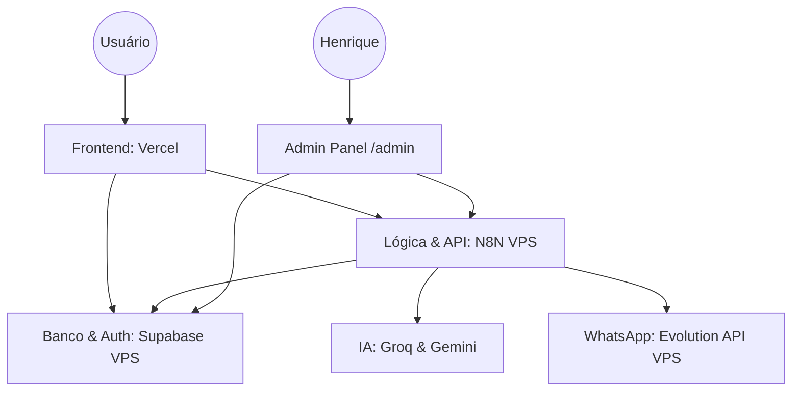

# 🚀 Ecossistema HLJ DEV - Documentação Técnica

Bem-vindo à documentação oficial do ecossistema **hljdev.com.br**. Este documento descreve a arquitetura, infraestrutura, backend e frontend do projeto, servindo como guia central para desenvolvimento e manutenção.

---

## 🏗️ Visão Geral da Arquitetura

O ecossistema é baseado em uma arquitetura moderna de **Single App Frontend** com **Backend como Serviço (BaaS)** e **Automação Low-Code**.



### Componentes Chave:
- **Frontend**: React (Vite) + Tailwind CSS + Shadcn UI.
- **Backend de Automação**: N8N (Orquestração de lógica e webhooks).
- **Banco de Dados & Auth**: Supabase (PostgreSQL auto-hospedado).
- **Mensageria**: Evolution API (WhatsApp).
- **Infraestrutura**: VPS Linux + Docker Compose + Caddy (Proxy).

---

## 🎨 Frontend (Interface do Usuário)

O frontend é uma aplicação única que contém o portfólio público e o painel administrativo restrito.

### Stack Tecnológica:
- **Framework**: React 18 com Vite.
- **Estilização**: Tailwind CSS para design responsivo e moderno.
- **Componentes**: Shadcn UI (Radix UI) para acessibilidade e consistência.
- **Animações**: Framer Motion.
- **Gerenciamento de Estado**: React Query (TanStack Query) para sincronização com o banco de dados.
- **Roteamento**: React Router DOM v6.

### Estrutura de Páginas (`src/pages`):
- `/`: Landing page principal (Portfólio).
- `/projects`: Galeria de projetos realizados.
- `/contact`: Formulário de contato/discovery.
- `/shop`: Loja dinâmica integrada ao Supabase.
- `/links`: Árvore de links (Bio).
- `/login`: Autenticação administrativa.
- `/admin/*`: Dashboard e ferramentas de gestão (Protegido por Supabase Auth).

### Painel Administrativo (`src/pages/admin`):
- **Dashboard**: Visão geral de KPIs e métricas.
- **Pipeline**: CRM Kanban para gestão de leads.
- **Projetos**: Gestão de entregas e cronogramas.
- **Tarefas**: Agenda de follow-ups e lembretes.
- **Maps**: Integração com dados geográficos de leads.
- **Config**: Configurações de sistema e templates de mensagens.

---

## ⚙️ Backend & Lógica (N8N + IAs)

Toda a lógica "pesada" e integrações externas são tratadas pelo **N8N**, eliminando a necessidade de uma API Node.js tradicional.

### Fluxos Principais (Workflows):
1.  **Lead Inteligente**: Captura dados do formulário, calcula o Lead Score via IA e notifica no WhatsApp.
2.  **Vendas Kiwify**: Recebe webhooks da Kiwify, registra no Supabase e envia mensagens de boas-vindas.
3.  **Proposta IA**: Gera mockups usando **Gemini Image** e textos persuasivos usando **Groq (Llama 3.3)**.
4.  **Relatório Semanal**: Consolida dados do banco e envia um resumo de performance todo domingo.
5.  **Agenda Automática**: Verifica tarefas próximas ao vencimento e dispara alertas via WhatsApp.

### Provedores de IA:
- **Groq API**: Processamento de linguagem natural ultra-rápido (Llama 3.3).
- **Gemini Flash (Nano Banana)**: Geração de imagens e mockups para propostas.

---

## 🗄️ Banco de Dados & Segurança (Supabase)

O **Supabase** atua como o core de dados e autenticação, rodando em containers Docker na VPS.

### Tabelas Principais:
- `leads`: Dados de prospecção e score.
- `propostas`: Armazenamento de propostas geradas.
- `vendas`: Histórico de transações.
- `produtos`: Catálogo dinâmico da loja.
- `tarefas`: Registro de compromissos e follow-ups.
- `atividades_log`: Auditoria de ações no sistema.

### Segurança:
- **JWT (JSON Web Tokens)**: Usado para validar sessões entre o frontend e as funções do Supabase.
- **RLS (Row Level Security)**: Garante que apenas o administrador tenha acesso aos dados sensíveis via políticas de banco.

---

## 🌐 Infraestrutura (VPS & DevOps)

A infraestrutura é otimizada para baixo custo e alta performance, utilizando Docker para isolamento.

### Servidor (VPS):
- **SO**: Linux (Ubuntu/Debian).
- **Orquestração**: Docker Compose.
- **Proxy/SSL**: Caddy Server (Gerenciamento automático de HTTPS).

### Containers (Docker):
- `supabase-db`: PostgreSQL 15.
- `hlj-n8n`: Servidor N8N.
- `hlj-evolution`: Evolution API para WhatsApp.
- `supabase-auth/rest/kong/studio`: Suite completa do Supabase.

### Comandos Úteis (VPS):
```bash
# Atualizar infraestrutura
cd /root/hlj-dev
ssh root@23.80.89.116
docker compose up -d --build

# Recarregar configurações do Proxy
systemctl reload caddy
```

---

## 🚀 Fluxo de Desenvolvimento

1.  **Mudanças de UI**: Alterar código no VS Code local → Push para Git → Deploy automático na Vercel.
2.  **Mudanças de Lógica**: Acessar `n8n.hljdev.com.br` → Editar workflow visualmente → Salvar.
3.  **Mudanças de Banco**: Acessar `db.hljdev.com.br` (Supabase Studio) → Modificar schema via SQL Editor.

---

> [!NOTE]
> Esta documentação é um documento vivo. Ao adicionar novas funcionalidades ou alterar a infraestrutura, certifique-se de atualizar as seções correspondentes.
